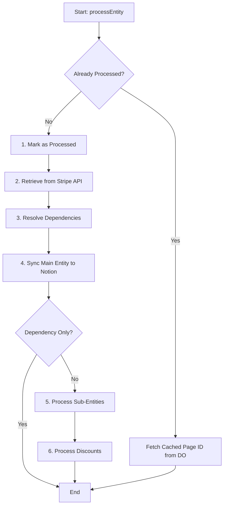

# Entity Processor Workflow (`entity-processor-refactored.ts`)

This document provides a comprehensive, step-by-step explanation of how the `EntityProcessor` works. Its primary goal is to reliably synchronize a Stripe entity and all its related data (dependencies, sub-entities, discounts) to their corresponding Notion databases.

## High-Level Architecture

The system is designed with a service-oriented architecture. The `EntityProcessor` acts as a central orchestrator, delegating specific tasks to a set of specialized services. This design keeps the main processor clean and adheres to the Single Responsibility Principle.

**Core Components:**

- **`EntityProcessor`**: The main orchestrator that manages the end-to-end synchronization workflow.
- **Services**: 
  - `EntityCache`: Tracks entities processed within a single session to prevent redundant work.
  - `DependencyProcessor`: Resolves and processes parent entities that the main entity depends on (e.g., an Invoice's Customer).
  - `NotionSyncService`: Handles the final conversion of Stripe data to Notion properties and manages the upsert operation.
  - `DiscountProcessor`: Manages the synchronization of any discounts associated with an entity.
  - `SubEntityProcessor` (Strategy): A set of processors (`InvoiceLineItemProcessor`, `SubscriptionItemProcessor`) for handling child entities (e.g., an Invoice's Line Items).
- **Durable Objects**:
  - `StripeEntityCoordinatorDO`: A critical component that acts as a distributed mutex, preventing race conditions by ensuring only one process can write to a specific Notion page at a time.

---

## Entry Points

The workflow is initiated through one of two main public methods:

1.  **`processEntityComplete(entityType, entityId, ...)`**: The primary entry point for processing a standard Stripe entity. It's used by webhook handlers and backfill workflows when a Stripe event provides an entity ID (e.g., `invoice.created`).
2.  **`processDiscountEvent(discountObject, ...)`**: A specialized entry point for handling discount objects, which are often embedded directly in other Stripe event payloads rather than being fetched by an ID.

---

## Step-by-Step Workflow: `processEntity`

This is the core method that orchestrates the synchronization. Here is a detailed breakdown of its execution flow.

### Step 0: Pre-flight Checks & Caching

Before any processing begins, the `EntityProcessor` checks if the entity has already been handled in the current session.

1.  **Check Cache**: The `EntityCache` service is consulted. If the entity (`entityType` + `entityId`) is found in the cache, it means it has already been processed during this execution.
2.  **Early Exit**: If cached, the processor skips the full workflow. It makes a call to the **`StripeEntityCoordinatorDO` (Durable Object)** to retrieve the already-known Notion Page ID for the entity. This is crucial for dependency resolution, as it provides the necessary ID for linking without reprocessing the entire entity.

### Step 1: Mark as Processed

If the entity is not in the cache, it is immediately marked as processed in the `EntityCache` to prevent any potential loops during recursive dependency resolution.

### Step 2: Retrieve Entity from Stripe API

The processor makes a network call to the **Stripe API (External System)** to fetch the full, expanded object for the given `entityId`. The `ENTITY_REGISTRY` configuration specifies which fields to expand to ensure all necessary data (like dependencies and sub-entities) is included in the response.

### Step 3: Resolve Dependencies

This crucial step is delegated to the `DependencyProcessor` service. Its job is to ensure that any entity the current entity depends on already exists in Notion.

- The `DependencyProcessor` identifies all dependencies listed in the entity's configuration (e.g., an Invoice depends on a Customer).
- For each dependency, it recursively calls back to the main `processEntity` method, but with a special option: `isForDependencyResolution: true`.
- This flag ensures the recursive call performs a **"shallow" upsert**: it will process the dependency just enough to get it into Notion and retrieve its Page ID, but it will **not** trigger the processing of that dependency's own sub-entities or discounts.

### Step 4: Sync Main Entity to Notion

Once all dependencies have been resolved and their Notion Page IDs are known, the `NotionSyncService` takes over.

1.  **Convert Properties**: It converts the Stripe entity object into a set of Notion properties, linking the dependency Page IDs gathered in the previous step.
2.  **Coordinated Upsert**: The service then calls `coordinatedUpsert`. This function does not write to Notion directly. Instead, it calls the **`StripeEntityCoordinatorDO` (Durable Object)**.
    - The Durable Object acts as a lock for the specific Stripe entity ID. It ensures that if two events for the same entity arrive simultaneously, they are processed sequentially, preventing corrupted data or race conditions.
    - The Durable Object is responsible for making the final API call to the **Notion API (External System)** to create or update the page.

### Step 5: Process Sub-Entities (Strategy Pattern)

After the main entity has been successfully synced, the processor checks if it has any child entities that need to be processed (e.g., Line Items for an Invoice).

- It consults the `ENTITY_REGISTRY` for the current `entityType`.
- If the configuration has a `getSubEntityProcessor` function, it invokes it. This function acts as a factory, returning the correct sub-entity processor (e.g., `InvoiceLineItemProcessor`).
- This processor is then called to handle the synchronization of all sub-entities. This process is also recursive and uses the same `coordinatedUpsert` and **Durable Object** logic to ensure data integrity.

### Step 6: Process Discounts

Finally, the `DiscountProcessor` is called. It inspects the main Stripe entity for any attached discount objects. If a discount exists, the processor ensures it is synced to the central "Discounts" database in Notion, linking it back to the main entity that was just created.

---

## Composition Root (Dependency Injection)

The `EntityProcessor` and all its service dependencies are instantiated and wired together in the static factory methods `fromWebhook` and `fromWorkflow`. This is the **Composition Root** of the architecture.

This pattern allows for clean dependency injection and resolves the circular dependency between the `EntityProcessor` and the `DependencyProcessor` at a single, controlled point, keeping the modules themselves decoupled and easy to test.